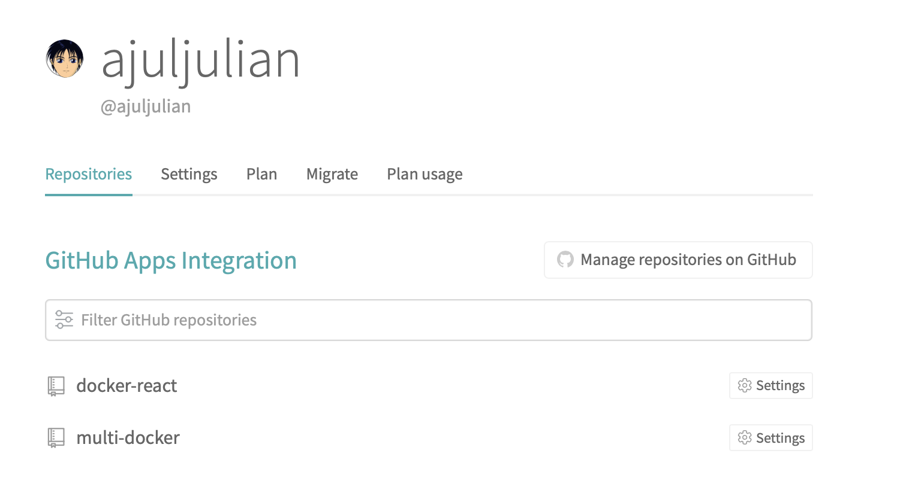
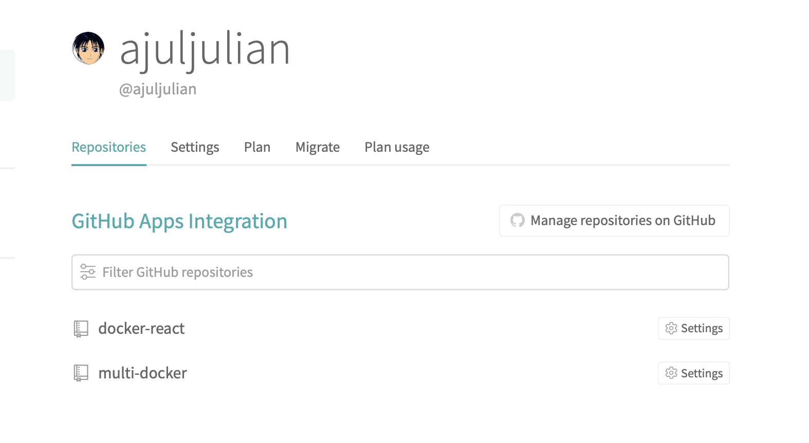
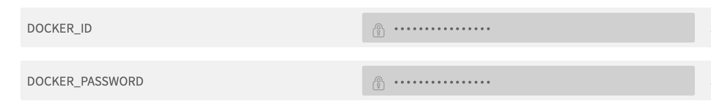
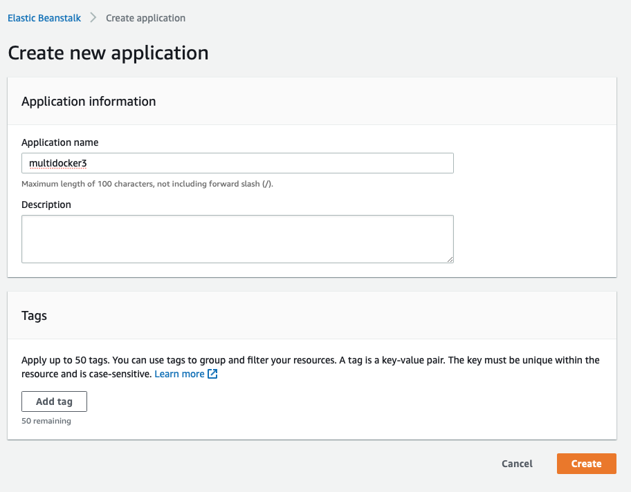
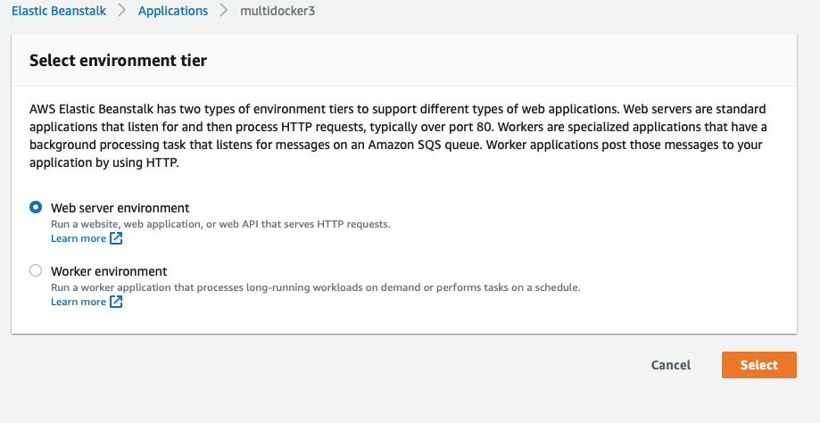
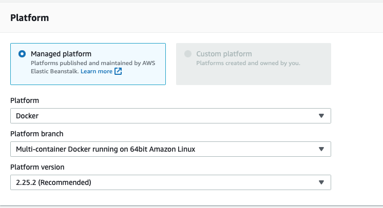
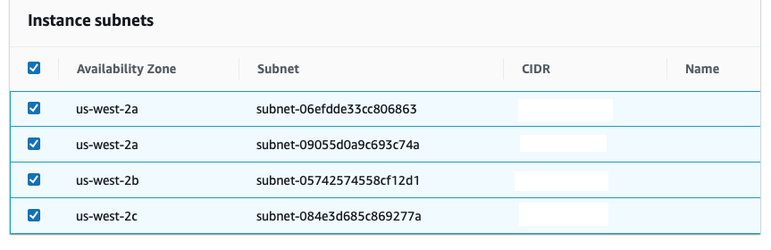
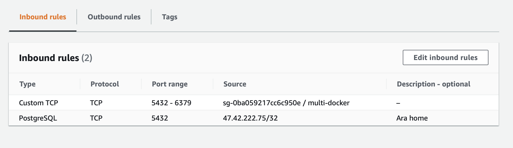
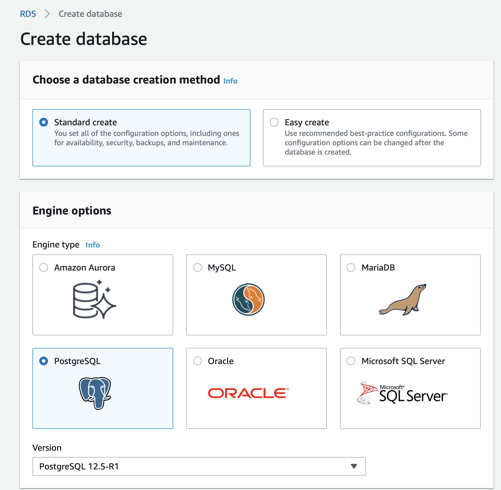
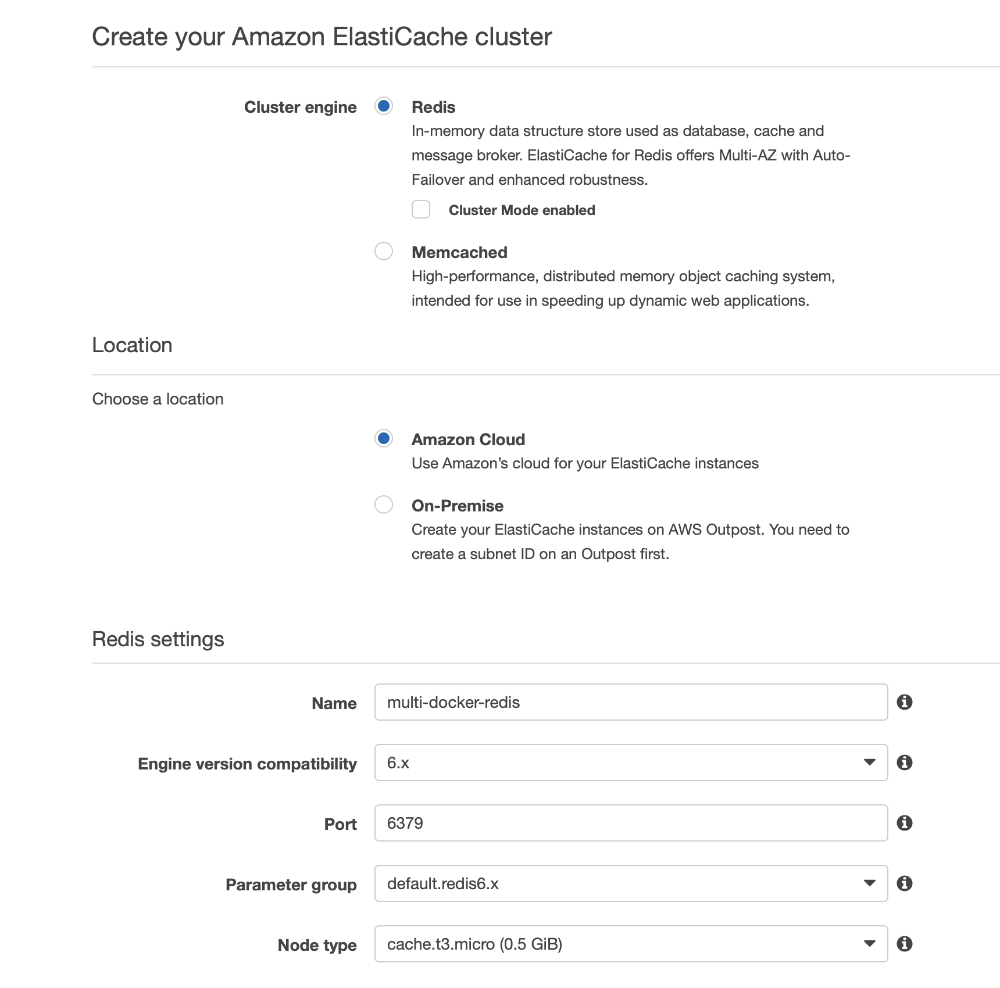

# Multi-Docker

Example React app using multiple Docker containers and capable of being
deployed on Amazon Elastic Beanstalk.

This is based on the following Udemy course: https://www.udemy.com/course/docker-and-kubernetes-the-complete-guide/

For storage, we're making use of Postgres and Redis, but instead of managing
these services within our containers, we're accessing them through AWS RDS and
ElastiCache.


## App architecture

1. Nginx
1. React server
1. Express server
1. Worker
1. Redis
1. Postgres

## App flow

1. User submits a number
1. React app sends number to Express server
1. Express server stores number in Postgres database
1. Express server puts number in Redis
1. Worker listens to Redis insert events, calculates the Fibonacci value recursively (slow), and puts it back in Redis


## Important files:

### Worker:

> package.json

	dependencies:
		nodemon - live reload of code
		redis client
	scripts:
		one for dev (starts nodemon)
		one for prod (runs `node index.js`)

> keys.js

	Exports redis host/port (from environment variables)

> index.js

	Subscribes to redis insert events
	Every time you get a message (the key) on a given channel, calculate the Fibonacci value of that key and set it in redis where the key is the number and the value is the Fibonacci of that number.


### Server

> package.json

	dependencies:
		nodemon - live reload of code
		redis client
		postgres client
		cors - cross origin resource sharing
		express
	scripts:
		one for dev (starts nodemon)
		one for prod (runs `node index.js`)

> keys.js

	Exports info about the redis and postgres instances (from environment variables)

> index.js

	Creates express application
	Sets up Postgres client
	Creates `values` table if one does not exist - contains one int (the number we’re computing the Fibonacci of)
	Sets up Redis client
	Sets up Express route handlers:
		`GET /values/all`: queries Postgres’ `values` table for all numbers we’ve calculated Fib of
		`GET /values/current`: queries Redis  for all the indexes and accompanying values that have been calculated so far (Redis node client does not support promises, so we need to use callbacks instead of the `await` keyword)
		`POST /values`: 
			1. Gets a number from the user, makes sure it’s not too large (otherwise calculating Fib would take a long time), 
			2. Adds the index to the `values` hash set with a value of `Nothing yet!`, 
			3. Publishes an `insert` event on Redis (for the worker to wake up and process), 
			4. Inserts value into Postgres
	Starts listening on port 5000


### Client

Create React app:

`npx create-react-app client`

> Otherpage.js

	Just to show react routing

> Fib.js

	Creates a `Fib` component.  
	When the component mounts,  we issue requests to `api/values/current` (queries Redis) and `api/values/all` (queries Postgres)
	renders a form
	When a value is submitted, posts value to `api/values`
	also renders the seen indexes (from Postgres response) and calculated values (from Redis response)

> App.js

	Uses `Router` component (which wraps everything) for routing
	Uses something like this for routing: 

    <Route exact path="/" component={Fib} />
    <Route path="/otherpage" component={OtherPage} />


## Dockerizing:

Create `Dockerfile.dev` file in `server`
	
    Downloads the node alpine Docker container image (vanilla node)
	Creates a work directory in /app
	Copies package.json over and runs npm install
	Copies everything else over
	Sets the command to run on container start to `npm run dev`


> docker-compose.yml

For volumes, when we say
```
volumes:

	- /app/node_modules
	- ./server:/app
```


we are pretty much saying that, except for the node_modules folder, everything else should be mounted from the `./server folder` onto `/app`.  So anytime we change code in server/app, our change will be reflected in the container so we won’t have to rebuild the container every time we change code.

For environment:

Anytime we want to access a service that has been defined in a docker-compose file, we just have to specify the name of the service.  So we can do things like:
```
environment:

	- REDIS_HOST: redis
```

Nginx

> default.conf

	Specifies two upstream servers, one at port 3000, the other at port 5000
	Listens on port 80
	/* goes to port 3000 (react server)
	/api/* goes to port 5000 (express server).  In addition, the url gets re-written by removing the /api portion


Note:

During development, we also want to allow the browser to establish web socket connections to the react server.  We do this by adding this to nginx:

```
location /sockjs-node {
        proxy_pass http://client;
        proxy_http_version 1.1;
        proxy_set_header Upgrade $http_upgrade;
        proxy_set_header Connection "Upgrade";
    }
```

Now create a Dockerfile from the nginx image and copy `default.conf` over

```
FROM nginx
COPY *./default.conf* */etc/nginx/conf.d/*

```


## Travis

Add `.travis.yml` file at the root of your project
Once you commit your project to GitHub, go to travis-ci.com and select “Manage Repositories on Github”



Starting Docker containers  locally:

```
$ docker-compose up --build
```


## Deploying to AWS ElasticBean:

Flow:
1. Push code to Github
2. Have Travis CI pull the repo
3. Travis CI builds a test image
4. Travis CI tuns tests
5. Travis CI build production images
6. Travis CI pushes production images to Docker Hub
7. Travis CI pushes the project to AWS ElasticBean
8. ElasticBean pulls images from Docker Hub and deploys

### Create Production Dockerfiles

> Worker:

Almost identical to Dockerfiles.dev
Only difference is the startup command:
`CMD [”npm”, “run”, “start”]` instead of `CMD [”npm”, “run”, “dev”]`

> Server:

Almost identical to Dockerfiles.dev
Only difference is the startup command:
`CMD [”npm”, “run”, “start”]` instead of `CMD [”npm”, “run”, “dev”]`

> Nginx:

No difference from Dockerfile.dev

> Client:

This one is a bit different. It uses a multi-stage build process.
Stage 1: build the app by installing dependencies and copying source file
Stage 2: create container from Nginx image and copy app and config (default.conf) into. Expose it through port 3000.

### Setup Github repo

Create Github repo and push the project into

### Setup Travis CI
Go to [Travis CI - Test and Deploy with Confidence](https://www.travis-ci.com)

Make sure you give Travis CI access to the Github repo:



Create `.travis.yml` file:

Before install, build the development client container (Dockerfile.dev)
After building, run tests
If the tests are successful, build production versions of all containers, tag, and push to Docker Hub.

Note: add your Docker ID and password as environment variables in Travis



## Deployment to AWS Elastic Beanstalk
Dockerrun.aws.json: tells Elastic Beanstalk about the containers it needs to work with.

Elastic Beanstalk delegates the hosting of Docker containers to Elastic Container Store (ECS) which uses Task Definition files.  Dockerrun.aws.json is how we provide these task definitions.

Note: links are uni-directional.  For example, we’re forming links from nginx to client and from nginx to server.

### Create Elastic Beanstalk environment on AWS

Create a new application



Create a new (Web server) environment



Make sure to choose `Docker` for platform with `Multi-container Docker` for branch



Configure more options, modify network, and add instance subnets (otherwise, running into issues)



### Security Group to connect Elastic Beanstalk, Redis, Postgres



Apply this security group to EB, Redis, and Postgres.


### RDS Service (for Postgres)



- Remember what username/password you specified
- Public access: select no
- VPC Security Group: use the one you created that connects the EB, Postgres, and Redis services together.

### ElastiCache Service (Redis)



